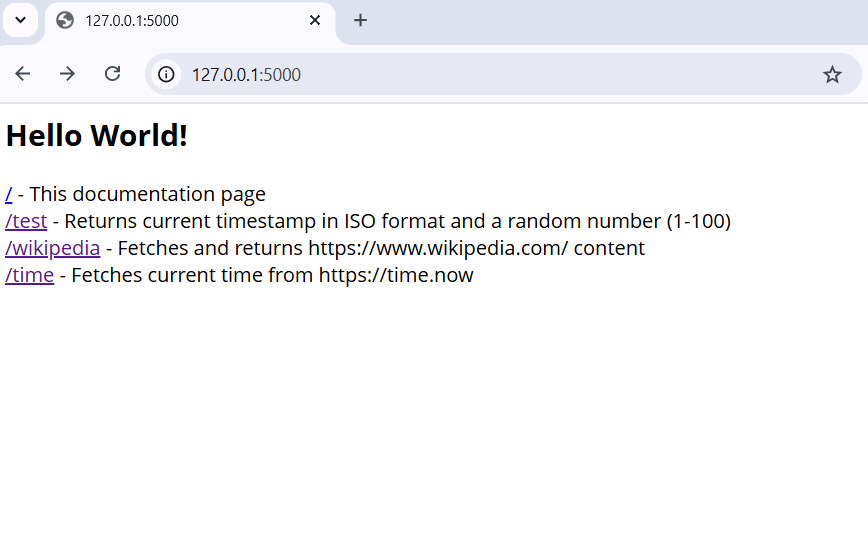

# Minimal Azure WebApp Python

This project provides a minimal Python Flask web application that can be deployed to Azure App Service. It includes automated scripts for dependency installation, Azure resource creation, and deployment.

## Quick Start Summary

For experienced users, here's the quick start process:

1. **Install Python 3.11** and **PowerShell 7**
2. **Run** `InstallDependencies.bat`
3. **Copy** `env-file-template.txt` to `.env` and configure your Azure settings
4. **Run** `CreateAzureWebApp.bat` to create Azure resources
5. **Run** `DeployAzureWebApp.bat` to deploy your application
6. **Visit** your web app URL to verify deployment

That's it! Your Flask application should now be running on Azure App Service.

## Table of Contents
1. [Project Overview](#project-overview)
2. [Prerequisites](#prerequisites)
3. [Required Packages](#required-packages)
4. [Installation Guide](#installation-guide)
5. [Environment Configuration](#environment-configuration)
6. [Creating the Azure Web App](#creating-the-azure-web-app)
7. [Deploying the Web App](#deploying-the-web-app)
8. [Additional Resources](#additional-resources)

## Project Overview

- Simple Flask web application with multiple endpoints
- Automated dependency installation
- Automated Azure Web App creation
- Automated deployment to Azure
- Environment-based configuration
- Cross-platform PowerShell scripts

### Project Structure

```
Minimal-Azure-WebApp-Python/
├── .vscode/                     # VS Code configuration
│   ├── launch.json              # Debug configuration for Flask
│   └── tasks.json               # Task to open browser automatically
├── src/                         # Application source code
│   ├── app.py                   # Main Flask application
│   └── requirements.txt         # Python dependencies
├── .env                         # Environment configuration (you create this)
├── env-file-template.txt        # Template for .env file
├── InstallDependencies.bat      # Install Python dependencies
├── CreateAzureWebApp.bat        # Create Azure resources (Windows)
├── CreateAzureWebApp.ps1        # Create Azure resources (PowerShell)
├── DeployAzureWebApp.bat        # Deploy application (Windows)
├── DeployAzureWebApp.ps1        # Deploy application (PowerShell)
├── .gitignore                   # Git ignore rules
├── LICENSE                      # Project license
├── README.md                    # This documentation
└── assets/                      # Endpoint screenshots
    ├── WebApp-Root.jpg
    ├── WebApp-Test.jpg
    ├── WebApp-Wikipedia.jpg
    └── WebApp-Time.jpg
```

### Demo



## Prerequisites

Before you begin, ensure you have the following installed on your system:

### Required Software
1. **Python 3.11** or higher
   - Download from: https://www.python.org/downloads/
   - Ensure Python is added to your system PATH

2. **PowerShell 7** (required for automation scripts)
   - Download from: https://github.com/PowerShell/PowerShell/releases
   - Install to default location: `C:\Program Files\PowerShell\7\pwsh.exe`

3. **Azure CLI** (automatically installed by scripts if missing)
   - Manual installation: https://docs.microsoft.com/en-us/cli/azure/install-azure-cli

4. **Azure PowerShell Module** (automatically installed by scripts if missing)
   - Manual installation: `Install-Module -Name Az -Scope CurrentUser`

### Azure Requirements
- **Azure Subscription** with appropriate permissions
- **Resource Group** creation permissions
- **App Service** creation permissions

## Required Packages

The application uses the following Python packages as defined in `src/requirements.txt`:

```txt
Flask==3.0.0
gunicorn==23.0.0
requests==2.31.0
```

### Package Details

#### Flask (3.0.0)
- **Purpose**: Web framework for creating the web application
- **Features Used**: 
  - Route handling (`@app.route`)
  - Request handling (`request`)

#### Gunicorn (23.0.0)
- **Purpose**: WSGI HTTP Server for serving the Flask application in production
- **Usage**: Azure App Service uses Gunicorn to serve the Flask application
- **Configuration**: Automatically configured by Azure App Service

#### Requests (2.31.0)
- **Purpose**: HTTP library for making HTTP requests to external APIs
- **Features Used**: 
  - HTTP GET/POST requests
  - JSON response handling
  - API integration

## Installation Guide

### Step 1: Install Dependencies

The project includes an automated script to install all required Python packages.

#### Using InstallDependencies.bat

1. **Navigate to the project root directory**
2. **Double-click** `InstallDependencies.bat` or run from command prompt:
   ```cmd
   InstallDependencies.bat
   ```

#### What the script does:
```batch
@echo This will install all dependencies listed in ./src/requirements.txt
pause
@echo off
rem change to folder where BAT file is
cd /d "%~dp0"
pip install -r ./src/requirements.txt
pause
```

#### Manual Installation (Alternative)
If you prefer to install dependencies manually:
```cmd
cd /d "e:\dev\Minimal-Azure-WebApp-Python"
pip install -r ./src/requirements.txt
```

#### Verification
To verify installation was successful:
```cmd
pip list
```
You should see Flask and gunicorn in the output.

## Environment Configuration

### Step 1: Create .env File

The project uses environment variables for Azure configuration. You need to create a `.env` file based on the provided template.

#### Using the Template

1. **Copy the template file**:
   - Source: `env-file-template.txt`
   - Destination: `.env` (in project root)

2. **Template contents**:
   ```env
   # Azure Deployment
   AZURE_SUBSCRIPTION_ID=cccccccc-cccc-cccc-cccc-cccccccccccc
   AZURE_TENANT_ID=dddddddd-dddd-dddd-dddd-dddddddddddd
   AZURE_RESOURCE_GROUP=my-resourcegroup-2342934563
   AZURE_LOCATION=swedencentral
   AZURE_APP_NAME=my-webapp-934238764295
   AZURE_PYTHON_VERSION=3.11
   AZURE_APP_SERVICE_PLAN=appservice-plan
   ```

#### Step 2: Configure Your Values

Replace the template values with your actual Azure configuration:

| Variable | Description | Example | Required |
|----------|-------------|---------|----------|
| `AZURE_SUBSCRIPTION_ID` | Your Azure subscription ID | `12345678-1234-1234-1234-123456789012` | Yes |
| `AZURE_TENANT_ID` | Your Azure tenant ID | `87654321-4321-4321-4321-210987654321` | Yes |
| `AZURE_RESOURCE_GROUP` | Resource group name (will be created if doesn't exist) | `my-python-webapp-rg` | Yes |
| `AZURE_LOCATION` | Azure region for deployment | `swedencentral`, `eastus`, `westeurope` | Yes |
| `AZURE_APP_NAME` | Unique name for your web app | `my-unique-webapp-12345` | Yes |
| `AZURE_PYTHON_VERSION` | Python runtime version | `3.11`, `3.10`, `3.9` | Yes |
| `AZURE_APP_SERVICE_PLAN` | App Service Plan name | `my-app-service-plan` | Yes |

#### Step 3: Get Your Azure Subscription ID and Tenant ID

To find your Azure Subscription ID and Tenant ID:

1. **Using Azure Portal**:
   - Go to https://portal.azure.com
   - Navigate to "Subscriptions"
   - Copy the Subscription ID
   - Navigate to "Azure Active Directory"
   - Copy the Tenant ID

2. **Using Azure CLI**:
   ```cmd
   az account list --output table
   az account show --query "tenantId"
   ```

#### Step 4: Choose Azure Location

Common Azure locations:
- `swedencentral` (Sweden Central)
- `eastus` (East US)
- `westeurope` (West Europe)
- `southeastasia` (Southeast Asia)
- `australiaeast` (Australia East)

#### Step 5: Ensure Unique App Name

Your `AZURE_APP_NAME` must be globally unique across all Azure App Services.
Example: `mycompany-webapp-20240614-001`

## Creating the Azure Web App

### Overview

The project includes automated scripts to create all necessary Azure resources for your web app.

### Step 1: Prepare for Creation

1. **Ensure .env file is configured** (see Environment Configuration section)
2. **Ensure you have Azure permissions** to create resources
3. **Have your Azure credentials ready** for authentication

### Step 2: Run Creation Script

#### Using CreateAzureWebApp.bat

1. **Double-click** `CreateAzureWebApp.bat` or run from command prompt:
   ```cmd
   CreateAzureWebApp.bat
   ```

2. **Follow the prompts**:
   - The script will pause for confirmation before proceeding
   - Press any key to continue when prompted

#### What the script does:

```batch
@echo off
set PWSH="C:\Program Files\PowerShell\7\pwsh.exe"

if not exist %PWSH% (
    echo ERROR: PowerShell 7 not found at '%PWSH%'
    echo Please install PowerShell 7 from: https://github.com/PowerShell/PowerShell/releases
    pause
    exit /b 1
)

echo This will create the web app in Azure based on the configuration in the .env file
pause

rem change to folder where BAT file is
cd /d "%~dp0"
set SCRIPT=%~dp0CreateAzureWebApp.ps1

rem unblock the PowerShell script first
%PWSH% -Command "Unblock-File -Path %SCRIPT%"

rem now run the script with PowerShell 7
%PWSH% -f %SCRIPT%
pause
```

### Step 3: PowerShell Script Execution (CreateAzureWebApp.ps1)

The PowerShell script performs the following actions:

#### 3.1 Environment Validation
- Reads and validates the `.env` file
- Sets default values for optional parameters:
```
$config.OS = "Linux"
$config.AZURE_APP_SERVICE_PLAN_TIER = "Basic"
$config.AZURE_APP_SERVICE_PLAN_SIZE = "Small"
$config.AZURE_APP_SERVICE_PLAN_WORKER_COUNT = 1
```

#### 3.2 Tool Installation
- **Azure PowerShell Module**: Installs if not present
- **Azure CLI**: Downloads and installs if not present

#### 3.3 Azure Authentication
- Prompts for Azure login if not already authenticated
- Sets the correct subscription context

#### 3.4 Resource Creation
1. **Resource Group**: Creates if it doesn't exist
2. **App Service Plan**: Creates with specified configuration
3. **Web App**: Creates with Python runtime
4. **Configuration**: Sets up Python version and startup command

#### 3.5 Verification
- Confirms all resources were created successfully
- Displays the web app URL
- Shows configuration summary

### Step 4: Verify Creation

After the script completes successfully, you should see:

1. **Resource Group** in Azure Portal
2. **App Service Plan** with Basic tier
3. **App Service** with Python 3.11 runtime
4. **Web App URL** (will show default page until deployment)

### Manual Creation (Alternative)

If you prefer to create resources manually using Azure CLI:

```cmd
# Login to Azure
az login

# Set subscription
az account set --subscription "your-subscription-id"

# Create resource group
az group create --name "your-resource-group" --location "swedencentral"

# Create App Service Plan
az appservice plan create --name "your-app-service-plan" --resource-group "your-resource-group" --sku B1 --is-linux

# Create Web App
az webapp create --name "your-app-name" --resource-group "your-resource-group" --plan "your-app-service-plan" --runtime "PYTHON|3.11"

# Configure startup command
az webapp config set --name "your-app-name" --resource-group "your-resource-group" --startup-file "gunicorn --bind=0.0.0.0 --timeout 600 app:app"
```

## Deploying the Web App

### Overview

After creating the Azure Web App, you need to deploy your application code. The project includes automated deployment scripts.

### Step 1: Prepare for Deployment

1. **Ensure the Azure Web App is created** (see previous section)
2. **Verify your code is ready** in the `src/` directory
3. **Ensure you're authenticated to Azure**

### Step 2: Run Deployment Script

#### Using DeployAzureWebApp.bat

1. **Double-click** `DeployAzureWebApp.bat` or run from command prompt:
   ```cmd
   DeployAzureWebApp.bat
   ```

2. **Follow the prompts**:
   - The script will pause for confirmation before proceeding
   - Press any key to continue when prompted

#### What the script does:

```batch
@echo off
set PWSH="C:\Program Files\PowerShell\7\pwsh.exe"

if not exist %PWSH% (
    echo ERROR: PowerShell 7 not found at '%PWSH%'
    echo Please install PowerShell 7 from: https://github.com/PowerShell/PowerShell/releases
    pause
    exit /b 1
)

echo This will zip the source code and deploy it to the Azure Web App
pause

rem change to folder where BAT file is
cd /d "%~dp0"
set SCRIPT=%~dp0DeployAzureWebApp.ps1

rem unblock the PowerShell script first
%PWSH% -Command "Unblock-File -Path %SCRIPT%"

rem now run the script with PowerShell 7
%PWSH% -f %SCRIPT%
pause
```

### Step 3: PowerShell Script Execution (DeployAzureWebApp.ps1)

The PowerShell deployment script performs the following actions:

#### 3.1 Environment Validation
- Reads and validates the `.env` file
- Verifies Azure Web App exists
- Checks authentication status

#### 3.2 Code Preparation
- Creates a temporary deployment package
- Copies all files from `src/` directory
- Includes `requirements.txt` and `app.py`
- Creates a ZIP archive for deployment

#### 3.3 Deployment Process
- Uploads the ZIP package to Azure Web App
- Triggers the deployment process
- Monitors deployment status
- Installs Python dependencies automatically

#### 3.4 Post-Deployment
- Restarts the web app
- Verifies deployment success
- Displays the live web app URL

### Step 4: Verify Deployment

After successful deployment:

1. **Visit your web app URL**: `https://your-app-name.azurewebsites.net`
2. **Test the endpoints**:
   - `/` - Documentation page
   - `/test` - Returns timestamp and random number
   - `/wikipedia` - Fetches Wikipedia content
   - `/time` - Gets current time

### Manual Deployment (Alternative)

If you prefer to deploy manually using Azure CLI:

```cmd
# Navigate to project directory
cd /d "e:\dev\Minimal-Azure-WebApp-Python"

# Create deployment package
powershell -Command "Compress-Archive -Path './src/*' -DestinationPath './deployment.zip' -Force"

# Deploy to Azure Web App
az webapp deployment source config-zip --resource-group "your-resource-group" --name "your-app-name" --src "./deployment.zip"

# Clean up
del deployment.zip
```

### Deployment Troubleshooting

If deployment fails:

1. **Check logs**:
   ```cmd
   az webapp log tail --name "your-app-name" --resource-group "your-resource-group"
   ```

2. **Verify requirements.txt**:
   - Ensure all dependencies are listed
   - Check for version compatibility

3. **Check startup command**:
   ```cmd
   az webapp config show --name "your-app-name" --resource-group "your-resource-group" --query "appCommandLine"
   ```

### File Descriptions

#### Application Files
- **`src/app.py`**: Main Flask application with multiple endpoints
- **`src/requirements.txt`**: Python package dependencies

#### Configuration Files
- **`.env`**: Environment variables for Azure configuration (you create this)
- **`env-file-template.txt`**: Template showing required environment variables

#### Automation Scripts
- **`InstallDependencies.bat`**: Installs Python dependencies from requirements.txt
- **`CreateAzureWebApp.bat`**: Windows batch file to create Azure resources
- **`CreateAzureWebApp.ps1`**: PowerShell script for creating Azure resources
- **`DeployAzureWebApp.bat`**: Windows batch file to deploy the application
- **`DeployAzureWebApp.ps1`**: PowerShell script for deploying the application

#### Documentation
- **`README.md`**: Basic project overview
- **`DOCUMENTATION.md`**: This comprehensive documentation
- **`LICENSE`**: MIT license file

## Troubleshooting

### Common Issues and Solutions

#### 1. PowerShell 7 Not Found
**Error**: `ERROR: PowerShell 7 not found at 'C:\Program Files\PowerShell\7\pwsh.exe'`

**Solution**:
1. Download PowerShell 7 from: https://github.com/PowerShell/PowerShell/releases
2. Install to the default location
3. Restart your command prompt/terminal

#### 2. Azure Authentication Issues
**Error**: `Please run 'az login' to setup account.`

**Solution**:
```cmd
az login
az account set --subscription "your-subscription-id"
```

#### 3. App Name Already Exists
**Error**: `The app name 'your-app-name' is already taken`

**Solution**:
1. Choose a more unique app name
2. Update `AZURE_APP_NAME` in your `.env` file
3. Try adding random numbers or your initials

#### 4. Insufficient Azure Permissions
**Error**: `You do not have permission to create resources`

**Solution**:
1. Contact your Azure administrator
2. Ensure you have Contributor role on the subscription
3. Or create resources in a resource group where you have permissions

#### 5. Python Dependencies Installation Failed
**Error**: `pip install failed`

**Solution**:
1. Ensure Python is installed and in PATH
2. Try upgrading pip: `python -m pip install --upgrade pip`
3. Check internet connectivity
4. Try installing packages individually

#### 6. Deployment Package Too Large
**Error**: `Deployment package exceeds size limit`

**Solution**:
1. Remove unnecessary files from `src/` directory
2. Check for large files or directories
3. Ensure only essential files are included

#### 7. Web App Not Starting
**Error**: Web app shows error page after deployment

**Solution**:
1. Check application logs:
   ```cmd
   az webapp log tail --name "your-app-name" --resource-group "your-resource-group"
   ```
2. Verify startup command is correct
3. Check that `app.py` contains the Flask app variable
4. Ensure all dependencies are in requirements.txt

### Getting Help

If you encounter issues not covered here:

1. **Check Azure Portal**: Look at the App Service logs and metrics
2. **Azure CLI Logs**: Use `az webapp log` commands to see detailed logs
3. **PowerShell Verbose**: Add `-Verbose` flag to PowerShell commands
4. **Azure Documentation**: Visit https://docs.microsoft.com/en-us/azure/app-service/

## Additional Resources

### Azure Documentation
- [Azure App Service Documentation](https://docs.microsoft.com/en-us/azure/app-service/)
- [Deploy Python Apps to Azure](https://docs.microsoft.com/en-us/azure/app-service/quickstart-python)
- [Azure CLI Reference](https://docs.microsoft.com/en-us/cli/azure/)

### Flask Documentation
- [Flask Official Documentation](https://flask.palletsprojects.com/)
- [Flask Deployment Options](https://flask.palletsprojects.com/en/2.3.x/deploying/)

### PowerShell Resources
- [PowerShell 7 Documentation](https://docs.microsoft.com/en-us/powershell/)
- [Azure PowerShell Documentation](https://docs.microsoft.com/en-us/powershell/azure/)

### Python Resources
- [Python Official Documentation](https://docs.python.org/)
- [pip Documentation](https://pip.pypa.io/en/stable/)
- [Virtual Environments Guide](https://docs.python.org/3/tutorial/venv.html)

---
